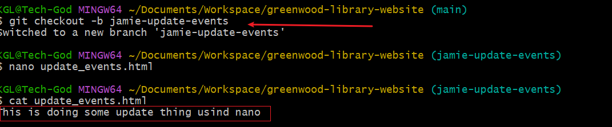

# Enhancing greenwood-library-website
The aim of this project is to create a new section called `Book reviews` and update the `events`page.

In accomplishing this task, three thing will need to be one.

- Cloning a repository and working git branches
- Staging,commiting and push changes to the 
- Create and merge pull request from all developers

## Create repository on github.
1.A repository is created in github and a README.md file is initialized 
2.In the main branch, create four .html files, home,about_us,contact_us and events. 
3.Stage,commiy and push changes made to the files. 
4. we then pull and merge the changes on github after resolving and conflict.   and 

## Jamie's work in updating event.
To update the event section, a branch is created for jamie. . In simulating all that morgan did, jamie has done same thing captured below 
A pull and merge request are the done on github to update the main.  and 

This concludes the end of the project.